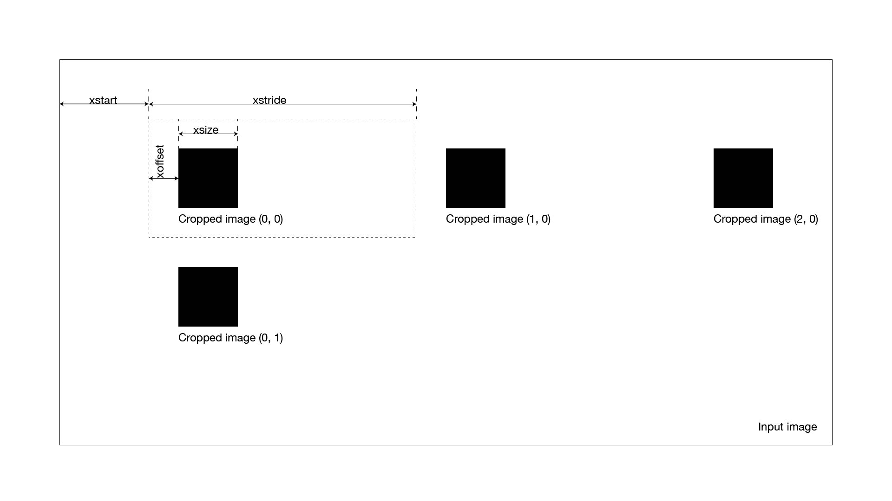

# sliceimage

Image slicer.

## Usage

```sh
python sliceimage.py --xstart {xstart} --ystart {ystart} --xstride {xstride} --ystride {ystride} --xoffset {xoffset} --yoffset {yoffset} --xsize {xsize} --ysize {ysize} input.png
```

